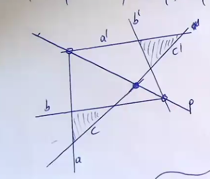

- Sprechweise:
  -  Ein Punkt _inzidiert_ mit einer Geraden wenn der Punkt auf der Geradne liegt
  - Eine Gerade _inzidiert_ mit einem Punkt wenn die Gerade durch den Punkt geht
- Def.: 
  - Eine Menge von Punkten heißt _kollinear_ wenn diese Punkte mit einer gemeinsamen Gerade inzidieren.
  - Eine Menge von Geraden heißt _kopunktal_ wenn diese Geraden mit einem gemeinsamen Punkt inzidieren.
- Die Menge aller Punkte, die mit einer Geraden inzidieren heißt _Punktreihe_
- Die Menge aller Geraden, die mit einem Punkt inzidieren heißt _Geradenbüschel_
- **Satz**: Seien $a,b$ zwei verschiedene Geraden mit homogenen Geradenkoordinaten $u,v\in\mathbb R^3\backslash \{0\}$, $u,v$ linear unabhängig, dann sind genau jene Geraden mit homogenen Geradenkoordinaten $\lambda u + \mu v$ mit $(\lambda, \mu)\in \mathbb R^2\backslash\{0\}$ die Geraden des Büschels in dem $a$ und $b$ liegen.

  Beweis: Analog zum Satz der Parameterdarstellung von Geraden.
- Bemerkung: Es gibt eine gewisse "Symmetrie" zwischen den Begriffen die bis jetzt vorgekommen sind.
- **Satz** (Dualitätsprinzip): Sei $\mathcal A$ eine beweisbare Aussage in $P^2$, die nur aus den Begriffen _Punkte, Geraden, schneiden, verbinden, inzidieren, kollinear, kopunktal_ besteht. Dann ist auch die _duale Aussage_ $\mathcal A^*$ wobei $\mathcal A^*$ aus $\mathcal A$ durch Vertauschen der Begriffe
  - Punkt $\leftrightarrow$ Gerade
  - schneiden $\leftrightarrow$ verbinden
  - kollinear $\leftrightarrow$ kopunktal
  entsteht.
- **Definition** Ein _Dreieck besteht aus drei Punkten, die nicht mit einer gemeinsamen Gerade inzidieren. Ein Dreiseit besteht aus drei Geraden, die nicht mit einem gemeinsamen Punkt inzidieren.
- Bemerkung: Verbindungsgeraden eines Dreiecks ist ein Dreiseit. Schnittpunkte eines Dreiseits sind ein Dreieck.
- Definition: Zwei Dreiecke $(A,B,C)$, $(A', B', C')$ heißen _perspektiv_, wenn es einen Punkt $Z$ gibt mit $(A,A',Z)$ kollinear, $(B,B',Z)$ kollinear, $(C,C',Z)$ kollinear. $Z$ heißt das _Zentrum_. 
- Definition:  Zwei Dreiseite $(a,b, c)$, $(a', b', c')$ heißen _perspektiv_, wenn es eine Gerade $p$ gibt mit $(a, a',p)$ kopunktal, $(b, b', p)$ kopunktal, $(c, c',p)$ kopunktal. $Z$ heißt das _Achse_.
- Lemma: Seien $A, B,C$ drei paarweise verschiedene Punkte auf einer Geraden. $A= [a], B = [b], C = [c]$. Es können $a,b,c$ so gewählt werden, dass $a+b = c$ gilt. 
  
  Beweis: $\exists\lambda, \mu$ mit $c = \lambda a + \mu b$. Setze $\tilde a := \lambda b, \tilde b := \mu b, \tilde c := c$. Dann gilt $\tilde a + \tilde b = \lambda a + \mu b = c = \tilde c$. Also sind $\tilde a, \tilde b, \tilde c$ genau solche Repräsentanten.
- **Satz**(Desargues): Zwei Dreiecke sind genau dann perspektiv bzgl. eines Zentrums wenn die dazugehörigen Dreiseite perspektiv bzgl. einer Achse sind. 
  "\Rightarrow"