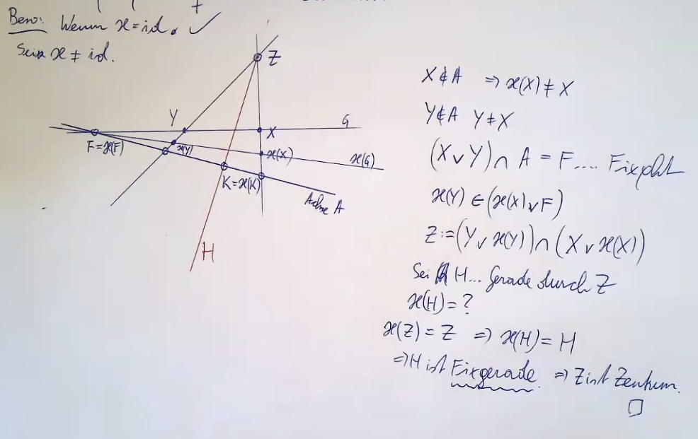
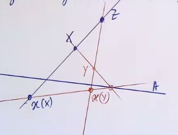
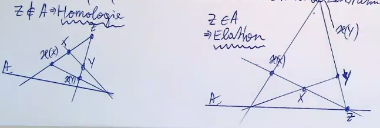
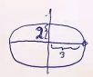

- **Definition**: Sei $\kappa: \P^2\to P^2$ eine projektive Transformation. Eine Gerade heißt _Fixpunktgerade_ oder _Achse_ von $\kappa$ wenn jeder Punkt dieser Gerade ein Fixpunkt ist. Ein _Zentrum_ ist ein Punkt sodass jede Gerade durch diesen Punkt bei $\kappa$ fest bleibt.
- Beispiel: Bei der Translation ist die Ferngerade eine Achse.
- Beispiel: Bei der $30^\circ$-Drehung ist dieser der einzige Fixpunkt $\Rightarrow$ keine Achse.
- Eine projektive Transformation heißt _perspektive Kollineation_, wenn sie eine Achse besitzt.
- **Satz** Jede perspektivische Kollineation besitzt ein Zentrum.
  
- Bemerkung: Wenn $\kappa$ eine Achse besitzt, dann auch ein Zentrum
- **Satz** Jede projektive Transformation die ein Zentrum besitzt ist perspektive Kollineation.
- Bemerkung: Eine perspektive Kollineation ist durch Ahse, Zentrum und ein Punktepaar $(X,\kappa(X))$ in geeigneter Lage (d.h. $(X\lor\kappa(X)\ni Z$) bestimmt.

  
  Eindeutigkeit folgt aus Desargues
- **Definition** Sei $\kappa$ eine perspektivische Kollineation mit Achse $A$ und Zentrum $Z$. Gilt $Z\in A$, so heißt $\kappa$ _Homologie_. Gilt $z\in A$ so heißt $\kappa$ _Elation_. 

## Kegelschnitte

- Beispiel: $\frac{x^2}9+\frac{y^2}4 = 1$ eine Ellipse  . Wann liegt $[(x_0,x_1,x_2)]$ auf dieser Ellipse? $[(1, \frac{x_1}{x_0},\frac{x_2}{x_0})]$ bzw. $\frac{(\frac{x_1}{x_0})^2}9 + \frac{(\frac{x_2}{x_0})^2}4 = 1$ und deswegen $-x_0^2 + \frac19x_1^2 + \frac14x_2^2$.
- **Definition** Sei $A\in \mathbb R^{3\times3}\backslash\{0\}$. Dann heißt $Q:= \{[x]\in P^2| x^T\cdot A\cdot x = 0\}$ _Kegelschnitt_. $x^TAx = 0$ heißt _Gleichung des Kegelschnitts_.   
- Bemerkung: $\lambda\cdot A$ für $\lambda \neq 0$ beschreibt denselben Kegelschnitt.
- **Definition** $A\in \mathbb R^{n\times n}$ heißt _symmetrisch_ wenn $A^T=A$.
- **Satz** Wir können stets voraussetzen, dass die Matrix, die $Q$ beschreibt, symmetrisch ist.

  Beweis: Sei $A\in \mathbb R^{3\times3}\backslash \{0\}$. $x^TAx = 0\Leftrightarrow 2x^TAx = 0\Leftrightarrow x^TAx + x^TAx = 0 \Leftrightarrow x^TAx + (x^TAx)^T = 0 \Leftrightarrow x^TAx + x^TA^Tx = 0\Leftrightarrow x^T(A+A^T)x = 0$. Nun ist $A+A^T$ symmetrisch.
- **Von hier an setzten wir stets voraus, dass $A$ symmetrisch ist.**
- Bemerkung: $Q$ kann auch leer sein, z.B. $x_0^2+x_1^2+x_2^2 = 0$ oder $x_0^2+2x_1^2+x_2^2 = 0$. Insbesonder können wir von $Q$ als Punktmenge nicht auf die Gleichung schließen.
- Bemerkung: Würden wir die Gleichungen über $\mathbb C$ betrachten, dann könntne wir aus der Lösungsmenge auf die Gleichung schließen. (der Schluss von Lösungsmenge auf Gleichung geht auf allen algebraisch abgeschlossenen Körpern bis auf Vielfache).
- **Satz**: Sei $\kappa$ eine projektive Transformation, die von $T\in \mathbb R^{3\times3}$ dargestellt wird, d.h. $\kappa([x]) = [Tx]$. Sei $Q$ ein Kegelschnitt, die von $A\in \mathbb R^{3\times 3}\backslash \{0\}$ dargestellt wird (Gleichung $x^TAx = 0$). Dann ist $\kappa(Q)$ ein Kegelschnitt, der von $T^{-T}AT^{-1}$ dargestellt wird.

  Beweis: Sei $[x]\in \kappa(Q)$. $\Rightarrow \kappa^{-1}([x]) \in Q \Leftrightarrow [T^{-1}x]\in Q\Leftrightarrow (T^{-1}x)^TA(T^-1x)= 0\Leftrightarrow x^T(T^{-T}AT^{-1})x = 0$, das ist die Kegelschnittsgleichung von $\kappa(Q)$.
- **Definition** Sei $Q$ ein Kegelschnitt, der von $A$ dargestellt wird. Sei $[b]\in Q$. Ein Punkt mit $b^TA\neq 0$ heißt _regulär_, ein Punkt mit $b^TA$ heißt singulär.
